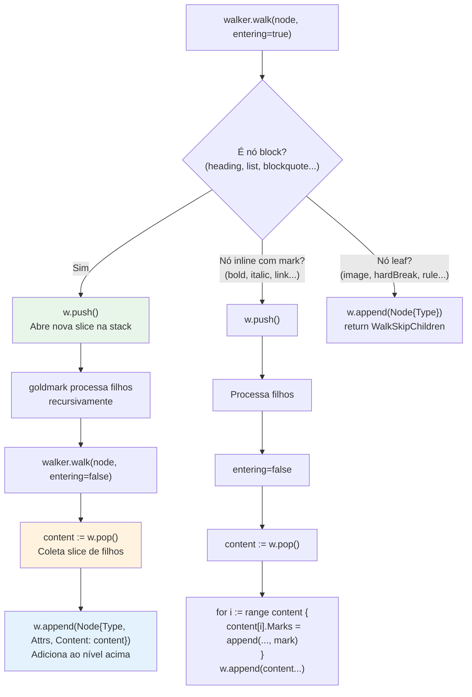

# Contribuindo para o md2confl

## Pré-requisitos

- **Go 1.25+** — o `go.mod` declara `go 1.25.5`
- **Git** — para clonar e commitar
- **Make** — opcional, mas recomendado para usar os targets padronizados

```bash
# Verificar versão do Go
go version
# go version go1.25.5 linux/amd64

# Clonar e verificar que tudo compila
git clone https://github.com/fmnapoli/md2confl.git
cd md2confl
make build && make test
```

## Build

```bash
# Build simples — binário em bin/md2confl
make build

# Build com versão customizada
VERSION=v1.0.0 make build

# Build direto sem Make
go build -o bin/md2confl ./cmd/md2confl
```

O Makefile injeta a versão automaticamente via ldflags usando `git describe --tags --always --dirty`. O binário resultante reporta essa versão com `md2confl --version`.

## Testes

### Rodar todos os testes

```bash
make test
# equivale a: go test -race ./...
```

### Rodar testes de um pacote específico

```bash
go test -v ./parser           # Parser (golden files)
go test -v ./confluence        # Cliente API (HTTP mocks)
go test -v ./internal/cli      # CLI (flags, output, diretórios)
```

### Rodar um caso de teste específico

```bash
go test -v -run TestConvertToADF/basic ./parser
go test -v -run TestRun_DryRun ./internal/cli
go test -v -run TestCreatePage ./confluence
```

### Suítes de testes

O projeto tem 3 suítes com estratégias diferentes:

| Pacote | Estratégia | Detalhe |
|--------|-----------|---------|
| `parser` | **Golden files** | Cada `testdata/<nome>.md` é convertido e o output é comparado byte-a-byte com `testdata/<nome>.json`. Novos cenários = novos pares de arquivos. |
| `confluence` | **HTTP mock** | Usa `httptest.NewTLSServer` para simular a API do Confluence. Cada teste cria um servidor fake que valida requests e retorna responses predefinidos. TLS é obrigatório porque o client rejeita URLs não-HTTPS. |
| `internal/cli` | **Unitários** | Testa a função `Run()` com diferentes combinações de args, verificando exit codes, stdout e stderr. Usa `t.TempDir()` para criar arquivos de teste efêmeros. |

## Golden files

Os testes do parser usam o padrão golden file para validar a conversão Markdown → ADF de forma determinística e legível.

### Estrutura

```
parser/testdata/
├── basic.md          # Headings, bold, italic, code, link, strike, lists, blockquote, rule
├── basic.json        # ADF esperado (279 linhas)
├── codeblock.md      # Fenced code blocks: go, python, sem linguagem
├── codeblock.json
├── table.md          # Tabela GFM (header + 2 linhas de dados)
├── table.json
├── mermaid.md        # Diagrama Mermaid em code fence
├── mermaid.json
├── multi-mermaid.md  # 2 diagramas Mermaid com parágrafo entre eles
├── multi-mermaid.json
├── empty.md          # Arquivo vazio (0 bytes de conteúdo)
└── empty.json        # {"version":1, "type":"doc", "content":[]}
```

### Como funciona

O teste (`parser/parser_test.go`) itera sobre todos os `.md` em `testdata/`, converte cada um com `ConvertToADF()`, serializa o resultado com `json.MarshalIndent`, e compara byte-a-byte com o `.json` correspondente.

```go
// Pseudo-código do fluxo:
input := ReadFile("testdata/basic.md")
doc   := ConvertToADF(input)
got   := json.MarshalIndent(doc)
want  := ReadFile("testdata/basic.json")
// got == want → pass
```

### Adicionar um novo caso de teste

1. Crie `parser/testdata/<nome>.md` com o Markdown que quer testar
2. Execute para gerar o golden file:
   ```bash
   go test ./parser -update
   ```
3. **Revise o JSON gerado** — abra `parser/testdata/<nome>.json` e verifique se a conversão está correta
4. Commit ambos os arquivos (`.md` + `.json`)

### Atualizar golden files existentes

Quando uma mudança intencional no parser altera o output ADF:

```bash
# Atualiza TODOS os golden files
go test ./parser -update

# Verificar o diff antes de commitar
git diff parser/testdata/

# Se o diff está correto, commit
git add parser/testdata/
```

> **Cuidado:** nunca faça `go test ./parser -update` seguido de `git add .` sem revisar o diff. Golden files atualizados sem inspeção podem mascarar regressões — o teste sempre vai passar porque o golden é o que o código gera, não o que é correto.

## Targets do Makefile

| Target | Comando executado | O que faz |
|--------|------------------|-----------|
| `build` | `go build -ldflags "-X main.Version=$(VERSION)" -o bin/md2confl ./cmd/md2confl` | Compila o binário com versão injetada via git describe |
| `test` | `go test -race ./...` | Executa todos os testes com race detector habilitado |
| `lint` | `go vet ./...` | Análise estática básica do Go |
| `cross-compile` | Loop de `GOOS/GOARCH go build` | Gera binários para 5 plataformas: `linux/amd64`, `linux/arm64`, `darwin/amd64`, `darwin/arm64`, `windows/amd64` |
| `license-check` | Scan de todos os `.go` | Verifica que cada arquivo Go começa com o header SPDX Apache-2.0. Falha com exit code 1 se algum arquivo estiver sem header. |
| `clean` | `rm -rf bin/` | Remove o diretório de binários compilados |

## Convenções

### License headers

Todo arquivo `.go` **deve** começar com:

```go
// Copyright 2026 md2confl contributors
// SPDX-License-Identifier: Apache-2.0
```

O CI valida isso com `make license-check`. Se criar um novo arquivo `.go`, adicione o header antes do `package`.

### Organização de pacotes

| Pacote | Visibilidade | Pode importar | Propósito |
|--------|-------------|---------------|-----------|
| `adf` | **Público** | Nenhum (zero deps internas) | Tipos de dados ADF puros — structs, construtores. Pode ser importado por projetos externos que queiram manipular ADF diretamente. |
| `parser` | **Público** | `adf` | Conversão Markdown → ADF. Único ponto de entrada: `ConvertToADF([]byte) (*adf.Document, error)`. Depende de `goldmark` como parser Markdown. |
| `confluence` | **Público** | Nenhum interno (usa `net/http` padrão) | Cliente REST API. Não depende de `adf` nem `parser` — recebe ADF como string JSON. Pode ser importado por projetos que queiram interagir com a API do Confluence. |
| `internal/cli` | **Interno** | `adf`, `parser`, `confluence` | Wiring — conecta tudo. Não é API pública, não deve ser importado por código externo. Mudanças aqui não quebram compatibilidade. |

### Regra de dependência

```
cmd/md2confl → internal/cli → parser → adf
                            → confluence
```

- `adf` não depende de nenhum outro pacote interno (é a "folha" do grafo)
- `parser` depende apenas de `adf`
- `confluence` não depende de nenhum pacote interno
- `internal/cli` é o único que conecta `parser` e `confluence`

### Commits

- Use [conventional commits](https://www.conventionalcommits.org/): `feat:`, `fix:`, `refactor:`, `test:`, `docs:`, `chore:`
- Mensagens breves e descritivas
- Não inclua "Claude Code" em mensagens de commit

### Erros

- Use `fmt.Errorf` com `%w` para wrapping
- Na camada `confluence`, retorne `*APIError` com categoria, HTTP status e hint acionável
- Na camada `cli`, converta `*confluence.APIError` para exit code 2

## Como adicionar um novo elemento Markdown → ADF

O parser usa um AST walker com uma stack de `[]adf.Node` para construir a árvore ADF. Ao entrar em um nó, a stack cresce (push); ao sair, os filhos são coletados (pop) e o nó completo é adicionado ao pai (append).

### Diagrama do walker



### Passo a passo

#### 1. Identifique o tipo AST do goldmark

Consulte a [documentação do goldmark](https://pkg.go.dev/github.com/yuin/goldmark/ast) para encontrar o tipo correto. Tipos core estão em `ast.*`, extensões GFM em `extension/ast.*` (importado como `east`).

```go
import (
    "github.com/yuin/goldmark/ast"
    east "github.com/yuin/goldmark/extension/ast"
)
```

#### 2. Adicione o case no switch de `walker.walk()`

O switch fica em `parser/parser.go`, na função `(w *walker) walk(node ast.Node, entering bool)`.

**Para nós block (contêm filhos):**

```go
case *ast.NewBlockType:
    if entering {
        w.push() // abre escopo para filhos
    } else {
        content := w.pop() // coleta filhos processados
        w.append(adf.Node{
            Type:    "adfNodeType",
            Attrs:   map[string]any{"attrName": attrValue}, // se tiver atributos
            Content: content,
        })
    }
```

**Para nós inline com marks (aplicam formatação ao conteúdo):**

```go
case *ast.NewInlineType:
    if entering {
        w.push()
    } else {
        content := w.pop()
        // Aplica a mark a cada nó de texto filho
        for i := range content {
            content[i].Marks = append(content[i].Marks, adf.Mark{
                Type:  "markType",
                Attrs: map[string]any{"key": "value"}, // se tiver atributos
            })
        }
        // Re-insere os filhos no nível acima (sem nó wrapper)
        for _, c := range content {
            w.append(c)
        }
    }
```

**Para nós leaf (sem filhos, como image ou rule):**

```go
case *ast.NewLeafType:
    if entering {
        w.append(adf.Node{
            Type:  "leafType",
            Attrs: map[string]any{"key": "value"},
        })
    }
    return ast.WalkSkipChildren, nil // NÃO processa filhos
```

#### 3. Consulte a especificação ADF

Verifique os tipos, atributos e estrutura válidos na [especificação ADF do Atlassian](https://developer.atlassian.com/cloud/jira/platform/apis/document/structure/).

#### 4. Crie golden files cobrindo o novo elemento

```bash
# Crie o Markdown de teste
echo '...' > parser/testdata/novo-elemento.md

# Gere o golden file
go test ./parser -update

# REVISE o output
cat parser/testdata/novo-elemento.json
```

#### 5. Execute todos os testes

```bash
go test ./...       # Tudo passa?
make license-check  # Header SPDX no novo arquivo?
make lint           # go vet limpo?
```

### Exemplo completo: adicionando suporte a footnotes

Suponha que se queira adicionar suporte a footnotes via extensão goldmark:

1. Adicione a extensão goldmark ao parser (em `parser.go`):
   ```go
   md := goldmark.New(goldmark.WithExtensions(extension.GFM, extension.Footnote))
   ```

2. Adicione o case no walker:
   ```go
   case *east.FootnoteLink:
       if entering {
           w.append(adf.Node{
               Type: "text",
               Text: fmt.Sprintf("[%d]", n.Index),
               Marks: []adf.Mark{{Type: "superscript"}},
           })
       }
       return ast.WalkSkipChildren, nil
   ```

3. Crie `parser/testdata/footnote.md`:
   ```markdown
   Text with a footnote[^1].

   [^1]: This is the footnote.
   ```

4. Gere e revise o golden: `go test ./parser -update`

5. Rode tudo: `go test ./...`
