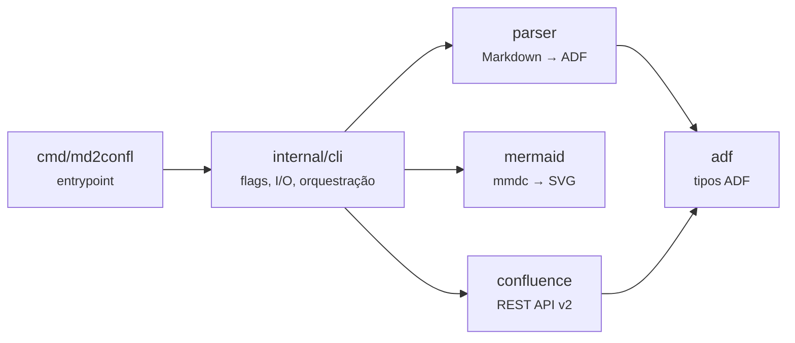
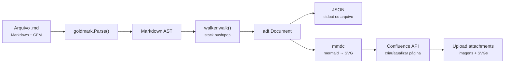
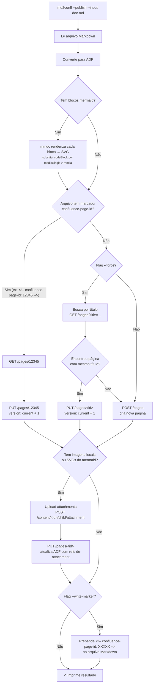
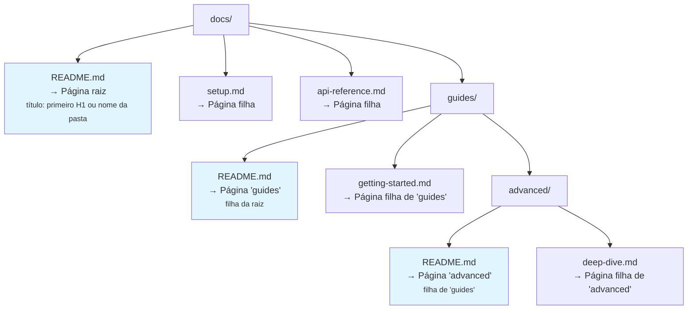

# md2confl

[](https://github.com/fmnapoli/md2confl/actions/workflows/ci.yml)
[](https://codecov.io/gh/fmnapoli/md2confl)
[](https://goreportcard.com/report/github.com/fmnapoli/md2confl)
[](https://pkg.go.dev/github.com/fmnapoli/md2confl)
[](LICENSE)
[](https://github.com/fmnapoli/md2confl/releases/latest)
[](https://hub.docker.com/r/fmnapoli/md2confl)

Converte arquivos Markdown para o formato [Atlassian Document Format (ADF)](https://developer.atlassian.com/cloud/jira/platform/apis/document/structure/) e publica diretamente no Confluence Cloud.

## Visão geral

O Confluence Cloud armazena conteúdo de páginas no formato ADF (Atlassian Document Format) — um JSON hierárquico de nós (headings, parágrafos, tabelas, etc.) e marcas (bold, italic, link, etc.). Escrever ADF manualmente é verboso e propenso a erros.

O `md2confl` resolve isso:

1. **Converte** Markdown (com extensões GFM — tabelas, strikethrough, autolinks) para ADF JSON válido, usando o parser [goldmark](https://github.com/yuin/goldmark) para construir a AST e um walker próprio para gerar a árvore ADF.

2. **Publica** páginas no Confluence Cloud via REST API v2, com autenticação Basic (email + API token).

3. **Sincroniza** hierarquias de diretórios como árvores de páginas — cada pasta vira uma página pai, cada `.md` vira uma página filha.

4. **Atualiza de forma idempotente** — marcadores `<!-- confluence-page-id: XXXXX -->` escritos no topo do Markdown permitem re-publicações que atualizam a mesma página sem duplicar.

5. **Lida com imagens locais** — referências a imagens locais (``) são automaticamente enviadas como attachments e vinculadas à página.

6. **Renderiza diagramas Mermaid** — blocos `mermaid` são pré-renderizados para SVG via `mmdc` (mermaid-cli) durante o publish e enviados como imagens. A imagem Docker inclui tudo necessário (`md2confl` + Node.js + Chromium + mmdc).

## Arquitetura



| Pacote | Visibilidade | Responsabilidade |
|--------|-------------|-----------------|
| `adf` | Público | Tipos de dados ADF — `Document`, `Node`, `Mark`. Representa o envelope JSON `{"version":1, "type":"doc", "content":[...]}` e a árvore de nós com atributos e marcas inline. |
| `parser` | Público | Converte `[]byte` Markdown para `*adf.Document`. Usa goldmark com extensão GFM para fazer parse, e um AST walker com stack para construir a árvore ADF. Entrada: bytes Markdown. Saída: documento ADF pronto para serializar. |
| `mermaid` | Público | Renderiza diagramas Mermaid para SVG via `mmdc` (mermaid-cli). Verifica disponibilidade do binário, gera nomes de arquivo determinísticos via SHA256 e configura puppeteer para ambientes Docker/CI. |
| `confluence` | Público | Cliente REST API v2 do Confluence Cloud. Resolve space key → ID, cria/atualiza páginas, busca por título, faz upload de attachments. Todos os erros são `*APIError` com categoria, status HTTP e hint acionável. |
| `internal/cli` | Interno | Orquestração CLI: parsing de flags, resolução de credenciais (flags > env vars), modos de operação (dry-run, output file, publish), processamento de diretórios, renderização de mermaid, upload de imagens locais, escrita de marcadores page-id. Não é API pública — só `main.go` importa. |

### Fluxo de dados



**Detalhes do walker:** O walker visita cada nó da AST duas vezes (`entering=true` e `entering=false`). Na entrada, faz `push()` na stack para abrir um escopo de filhos. Na saída, faz `pop()` para coletar os filhos e `append()` para adicionar o nó completo ao pai. Para nós inline com formatação (bold, italic, etc.), aplica marks em vez de criar nós wrapper. Nós leaf (imagens, breaks) usam `WalkSkipChildren` para evitar travessia desnecessária.

## Instalação

### Via `go install`

```bash
go install github.com/fmnapoli/md2confl/cmd/md2confl@latest
```

Isso compila e instala o binário em `$GOPATH/bin/md2confl` (ou `$HOME/go/bin/md2confl`).

### Build manual

```bash
git clone https://github.com/fmnapoli/md2confl.git
cd md2confl
make build
# binário em bin/md2confl
```

O `make build` injeta a versão via ldflags a partir de `git describe`, então o binário reporta a tag/commit correto com `--version`.

### Via Docker (recomendado para Mermaid)

A imagem Docker inclui `md2confl` + Node.js + Chromium + `mmdc`, sem necessidade de instalar nada além do Docker:

```bash
docker pull fmnapoli/md2confl:latest
```

Uso:

```bash
# Converter para ADF (stdout)
docker run --rm -v "$(pwd):/workspace" fmnapoli/md2confl --input doc.md

# Publicar no Confluence (diagramas mermaid são renderizados automaticamente)
docker run --rm -v "$(pwd):/workspace" \
  -e CONFLUENCE_URL="https://site.atlassian.net" \
  -e CONFLUENCE_EMAIL="user@example.com" \
  -e CONFLUENCE_TOKEN="seu-api-token" \
  fmnapoli/md2confl --input doc.md --publish --space DEVOPS --title "Minha Página"
```

Build local da imagem:

```bash
make docker
```

## Uso rápido

### 1. Converter para ADF JSON (stdout)

```bash
md2confl --input doc.md
```

Sem `--output` nem `--publish`, o ADF JSON é impresso no stdout. Útil para inspecionar o output ou redirecionar com pipe:

```bash
md2confl --input doc.md | jq '.content[0]'
```

**Exemplo de output** para um Markdown com heading e parágrafo:

```json
{
  "version": 1,
  "type": "doc",
  "content": [
    {
      "type": "heading",
      "attrs": { "level": 1 },
      "content": [
        { "type": "text", "text": "Título" }
      ]
    },
    {
      "type": "paragraph",
      "content": [
        { "type": "text", "text": "Texto do parágrafo com " },
        {
          "type": "text",
          "marks": [{ "type": "strong" }],
          "text": "negrito"
        },
        { "type": "text", "text": "." }
      ]
    }
  ]
}
```

### 2. Converter para arquivo

```bash
md2confl --input doc.md --output doc.json
```

Output:

```
✓ Converted doc.md → doc.json
```

### 3. Preview (dry-run com flags de publicação)

```bash
md2confl --input doc.md --dry-run --publish \
  --url https://site.atlassian.net \
  --space DEVOPS --title "Minha Página" \
  --email user@example.com
```

Imprime uma simulação no stderr mostrando o que seria publicado (título, espaço, URL) e o ADF JSON no stdout — sem fazer nenhuma chamada à API:

```
Dry-run: would publish to Confluence
  Title: Minha Página
  Space: DEVOPS
  URL: https://site.atlassian.net

{ ... ADF JSON ... }
```

### 4. Publicar no Confluence

```bash
export CONFLUENCE_TOKEN="seu-api-token"

md2confl --input doc.md --publish \
  --url https://site.atlassian.net \
  --space DEVOPS \
  --title "Minha Página" \
  --email user@example.com
```

Output:

```
✓ Published "Minha Página" → https://site.atlassian.net/wiki/spaces/DEVOPS/pages/12345/Minha+Página
  Page ID: 12345
  Action: created
  Version: 1
```

Para salvar o page ID no arquivo Markdown (permitindo atualizações futuras):

```bash
md2confl --input doc.md --publish --write-marker \
  --url https://site.atlassian.net \
  --space DEVOPS --title "Minha Página"
```

Isso prepende `<!-- confluence-page-id: 12345 -->` ao topo do `doc.md`.

### 5. Atualizar página existente (--force)

```bash
md2confl --input doc.md --publish --force \
  --url https://site.atlassian.net \
  --space DEVOPS --title "Minha Página"
```

Com `--force`, o md2confl busca uma página com o mesmo título no espaço. Se encontrar, atualiza. Se não encontrar, cria nova. Sem `--force` e sem marcador `confluence-page-id`, sempre cria uma nova página.

### 6. Publicar hierarquia de diretórios

```bash
md2confl --input docs/ --publish \
  --url https://site.atlassian.net \
  --space DEVOPS --parent-id 12345
```

Output (uma linha por página):

```
✓ Published "Documentação" → https://site.atlassian.net/wiki/...
  Page ID: 100
  Action: created
  Version: 1
✓ Published "Guia de Instalação" → https://site.atlassian.net/wiki/...
  Page ID: 101
  Action: created
  Version: 1
```

### 7. Output JSON estruturado

Para integração com CI/CD ou scripts, use `--json` para obter output em JSON em vez de texto:

```bash
md2confl --input doc.md --publish --json \
  --url https://site.atlassian.net \
  --space DEVOPS --title "Minha Página"
```

Output de sucesso:

```json
{
  "status": "success",
  "pageId": "12345",
  "pageUrl": "https://site.atlassian.net/wiki/spaces/DEVOPS/pages/12345/Minha+Página",
  "title": "Minha Página",
  "spaceKey": "DEVOPS",
  "action": "created",
  "version": 1
}
```

Output de erro:

```json
{
  "status": "error",
  "code": 2,
  "message": "authentication failed — invalid or expired API token",
  "hint": "verify your --token or CONFLUENCE_TOKEN environment variable"
}
```

## Referência de flags

| Flag | Tipo | Padrão | Descrição |
|------|------|--------|-----------|
| `--input` | `string` | — | Caminho para arquivo `.md` ou diretório. Obrigatória, exceto quando o config file define `documents`. Se diretório, processa recursivamente todos os `.md` respeitando a hierarquia de pastas. |
| `--config` | `string` | — | Caminho para arquivo de configuração YAML. Se omitido, auto-detecta `.md2confl.yml` no diretório corrente. |
| `--output` | `string` | — | Caminho do arquivo ADF JSON de saída. Mutuamente exclusivo com `--publish` e `--dry-run`. |
| `--dry-run` | `bool` | `false` | Imprime o ADF JSON no stdout sem publicar. Se combinado com `--publish`, mostra simulação (título, espaço, URL) no stderr. |
| `--publish` | `bool` | `false` | Publica no Confluence Cloud. Requer `--url`, `--space`, `--email` e `--token` (via flags ou env vars). |
| `--url` | `string` | — | URL base do Confluence Cloud (ex: `https://site.atlassian.net`). Deve usar HTTPS. Fallback: `CONFLUENCE_URL`. |
| `--space` | `string` | — | Chave do espaço no Confluence (ex: `DEVOPS`, `ENG`). O md2confl resolve a chave para o space ID via API. |
| `--parent-id` | `string` | — | ID numérico da página pai. Se omitido, a página é criada na raiz do espaço. No modo diretório, aplica-se apenas à página raiz. |
| `--title` | `string` | — | Título da página. Se omitido, usa o primeiro `# Heading` do Markdown; se não houver heading, usa o nome do arquivo sem extensão. No modo diretório, aplica-se apenas à página raiz. |
| `--email` | `string` | — | E-mail da conta Atlassian para autenticação Basic. Fallback: `CONFLUENCE_EMAIL`. |
| `--token` | `string` | — | API token da Atlassian. Fallback: `CONFLUENCE_TOKEN`. **Aviso:** passar via flag expõe o token no histórico do shell. |
| `--force` | `bool` | `false` | Busca página existente com o mesmo título no espaço e atualiza em vez de criar nova. Requer `--publish`. |
| `--write-marker` | `bool` | `false` | Após publicação bem-sucedida, escreve `<!-- confluence-page-id: XXXXX -->` no topo do arquivo Markdown fonte. Permite atualizações idempotentes futuras. Requer `--publish`. |
| `--mermaid` | `bool` | `false` | Renderiza blocos mermaid para SVG via `mmdc`. Sempre ativo com `--publish`. Use com `--dry-run` ou `--output` para preview dos diagramas renderizados. |
| `--json` | `bool` | `false` | Formata output (sucesso e erro) como JSON em vez de texto. Útil para integração com CI/CD. |
| `--version` | `bool` | `false` | Imprime a versão e sai com exit code 0. |

### Restrições entre flags

| Combinação | Resultado |
|-----------|-----------|
| `--output` + `--publish` | Erro: mutuamente exclusivos |
| `--output` + `--dry-run` | Erro: mutuamente exclusivos |
| `--force` sem `--publish` | Erro: `--force` requer `--publish` |
| `--write-marker` sem `--publish` | Erro: `--write-marker` requer `--publish` |
| `--publish` sem `--url` | Erro: URL obrigatória (flag ou `CONFLUENCE_URL`) |
| `--publish` sem `--space` | Erro: espaço obrigatório |
| `--publish` sem `--email` | Erro: email obrigatório (flag ou `CONFLUENCE_EMAIL`) |
| `--publish` sem `--token` | Erro: token obrigatório (flag ou `CONFLUENCE_TOKEN`) |

## Variáveis de ambiente

| Variável | Flag equivalente | Descrição |
|----------|-----------------|-----------|
| `CONFLUENCE_URL` | `--url` | URL base do Confluence Cloud |
| `CONFLUENCE_EMAIL` | `--email` | E-mail da conta Atlassian |
| `CONFLUENCE_TOKEN` | `--token` | API token da Atlassian |

**Precedência:** flag > config (document-level) > config (global-level) > variável de ambiente. Se ambos estão definidos, o nível mais específico vence.

> **Segurança:** prefira `CONFLUENCE_TOKEN` via variável de ambiente. Passar o token via `--token` na linha de comando o expõe no histórico do shell e na lista de processos (`ps`). O md2confl emite um warning no stderr quando detecta que o token foi passado via flag.

### Como obter o API token da Atlassian

O `md2confl` usa autenticação Basic (email + API token) para acessar a API do Confluence Cloud. Siga os passos abaixo para gerar seu token:

1. Acesse [https://id.atlassian.com/manage-profile/security/api-tokens](https://id.atlassian.com/manage-profile/security/api-tokens)
2. Clique em **Create API token**
3. Dê um nome descritivo (ex: `md2confl`)
4. Clique em **Create** e copie o token gerado

> **Importante:** o token é exibido apenas uma vez. Se perder, será necessário revogar e criar um novo.

Configure o token como variável de ambiente:

```bash
export CONFLUENCE_TOKEN="seu-api-token"
```

Para uso em CI/CD, armazene o token como secret (ex: GitHub Actions, GitLab CI) e injete via variável de ambiente. Nunca commite tokens em repositórios.

**Exemplo com env vars:**

```bash
export CONFLUENCE_URL="https://site.atlassian.net"
export CONFLUENCE_EMAIL="user@example.com"
export CONFLUENCE_TOKEN="seu-api-token"

# Agora só precisa das flags específicas da operação:
md2confl --input doc.md --publish --space DEVOPS --title "Minha Página"
```

## Arquivo de configuração

O `md2confl` suporta um arquivo de configuração YAML (`.md2confl.yml`) que centraliza defaults globais e mapeia documentos para publicação ou conversão. Isso elimina a repetição de flags como `--url`, `--space`, `--email`, etc.

### Formato do config

```yaml
# .md2confl.yml

# Defaults globais — aplicados a todos os documentos
url: https://site.atlassian.net
space: DEVOPS
email: user@example.com
parent-id: "12345"
force: true
write-marker: true

# Documentos — cada entry mapeia input → destino
documents:
  # Publish: input → Confluence
  - input: docs/architecture.md
    title: "Architecture Overview"
    # herda url, space, email, parent-id do global

  - input: docs/runbook.md
    title: "Operations Runbook"
    space: OPS                 # override do global
    parent-id: "67890"

  # Convert: input → arquivo JSON
  - input: docs/spec.md
    output: dist/spec.json     # sem publish — apenas converte

  - input: docs/onboarding.md
    # title derivado do H1 (comportamento default)
```

**Regras:**
- `token` **não pode** estar no config (segurança) — sempre via `CONFLUENCE_TOKEN` ou `--token`
- Se entry tem `output:` → modo convert (gera JSON); se não → modo publish
- `documents` é uma lista ordenada (processados em sequência)
- Cada entry precisa apenas de `input` — tudo mais é opcional e herda do global
- Caminhos relativos são resolvidos a partir do diretório do config

### Uso com config

```bash
# Processar TODOS os documents do config
md2confl --config .md2confl.yml

# Filtrar por um input específico
md2confl --config .md2confl.yml --input docs/runbook.md

# Override via flag (flag > config)
md2confl --config .md2confl.yml --space STAGING

# Preview sem publicar
md2confl --config .md2confl.yml --dry-run

# Sem config — comportamento atual inalterado
md2confl --input doc.md --publish --url https://... --space DEVOPS
```

### Auto-discovery

Sem `--config` explícito, o md2confl procura `.md2confl.yml` (ou `.md2confl.yaml`) no diretório corrente. Se encontrar, carrega silenciosamente e emite uma mensagem no stderr:

```
Using config: /path/to/.md2confl.yml
```

Se não encontrar, segue o fluxo normal baseado em flags.

### Precedência

```
flag > config (document-level) > config (global-level) > env var
```

## Exit codes

| Código | Categoria | Quando ocorre |
|--------|-----------|---------------|
| `0` | Sucesso | Conversão ou publicação concluída sem erros |
| `1` | Erro do usuário | Flags inválidas ou conflitantes, arquivo/diretório não encontrado, combinação inválida de opções |
| `2` | Erro da API | Autenticação falhou (401/403), recurso não encontrado (404), conflito de versão (409), conteúdo inválido (400/422), erro de rede |

No modo `--json`, erros retornam um JSON com `status`, `code`, `message` e `hint`:

```json
{
  "status": "error",
  "code": 2,
  "message": "space not found: INVALID",
  "hint": "verify the space ID or key is correct"
}
```

### Categorias de erro da API

| Categoria | HTTP Status | Mensagem | Hint |
|-----------|-------------|----------|------|
| `auth` | 401, 403 | `authentication failed — invalid or expired API token` | Verificar `--token` ou `CONFLUENCE_TOKEN` |
| `not_found` | 404 | `<resource> not found: <id>` | Verificar ID ou chave do recurso |
| `conflict` | 409 | `version conflict — page was updated concurrently` | Retentar a operação |
| `validation` | 400, 422 | `invalid ADF content: <detalhes>` | Verificar Markdown por elementos não suportados |
| `network` | Outros | `unexpected API response <code>: <body>` | Verificar conectividade e URL |

## Fluxo de publicação

Quando `--publish` é usado, o md2confl decide entre criar ou atualizar uma página com base em três critérios:



### Marcador de page ID

O marcador `<!-- confluence-page-id: XXXXX -->` é um comentário HTML que o md2confl insere no topo do arquivo Markdown quando `--write-marker` é usado. Ele permite:

- **Idempotência:** re-executar o mesmo comando atualiza a página em vez de criar uma cópia.
- **Rastreabilidade:** o arquivo Markdown carrega a referência direta para a página no Confluence.
- **Regex:** o formato é validado por `<!--\s*confluence-page-id:\s*(\d+)\s*-->`, então espaços extras são tolerados.

Se o marcador já existe no arquivo, ele é atualizado (não duplicado). Se não existe, é adicionado na primeira linha.

## Modo pasta

Quando `--input` aponta para um diretório, o `md2confl` mapeia a hierarquia de pastas para uma árvore de páginas no Confluence:



### Regras detalhadas

| Elemento | Comportamento |
|----------|--------------|
| `README.md` em um diretório | Vira a **página pai** daquele nível. O título é extraído do primeiro `# Heading` do README; se não houver heading, usa o nome do diretório. |
| Outros `*.md` no diretório | Viram **páginas filhas** da página criada pelo README (ou pela página vazia do diretório). O título de cada uma segue a mesma lógica: primeiro H1, senão nome do arquivo sem extensão. |
| Subdiretórios | Processados **recursivamente** com a mesma lógica. A página do subdiretório é filha da página do diretório pai. |
| Diretório sem `README.md` | Uma **página vazia** é criada como container para agrupar as filhas. O título é o nome do diretório. |
| `--title` no diretório raiz | A flag `--title` só se aplica à página raiz da hierarquia. As demais usam a lógica automática. |
| `--parent-id` | Define o pai da página raiz da hierarquia no Confluence. |
| `--write-marker` | Escreve o marcador `confluence-page-id` em **cada** arquivo `.md` processado. |
| Arquivos não-.md | Ignorados silenciosamente. |

### Exemplo concreto

Dado a estrutura:

```
docs/
├── README.md          # "# Documentação do Projeto"
├── instalacao.md      # "# Guia de Instalação"
├── faq.md             # (sem heading → título "faq")
└── guias/
    ├── README.md      # "# Guias Avançados"
    └── deploy.md      # "# Deploy em Produção"
```

Comando:

```bash
md2confl --input docs/ --publish --space DEVOPS --parent-id 999
```

Resultado no Confluence:

```
Página 999 (pai)
└── Documentação do Projeto        ← docs/README.md
    ├── Guia de Instalação         ← docs/instalacao.md
    ├── faq                        ← docs/faq.md
    └── Guias Avançados            ← docs/guias/README.md
        └── Deploy em Produção     ← docs/guias/deploy.md
```

## Mapeamento Markdown → ADF

A tabela abaixo mostra como cada elemento Markdown é convertido para o ADF correspondente:

| Markdown | ADF Node | Atributos | Notas |
|----------|----------|-----------|-------|
| `# Heading` … `###### H6` | `heading` | `level: 1..6` | Nível extraído da quantidade de `#` |
| Parágrafo | `paragraph` | — | Texto entre linhas em branco |
| `**bold**` | text com mark `strong` | — | Inline |
| `*italic*` | text com mark `em` | — | Inline |
| `` `code` `` | text com mark `code` | — | Inline |
| `~~strike~~` | text com mark `strike` | — | Extensão GFM |
| `[text](url)` | text com mark `link` | `href: url` | `title` adicionado se presente no Markdown |
| `<https://auto.link>` | text com mark `link` | `href: url` | Autolink — texto = URL |
| `` | `mediaSingle` > `media` | `type: external, url: url, layout: center` | Imagens locais (sem `http`) são uploadadas como attachments e convertidas para `type: file` |
| `` ```lang `` | `codeBlock` | `language: lang` | Sem linguagem → atributo omitido |
| `` ``` `` (sem lang) | `codeBlock` | — | Code block sem highlight |
| `> quote` | `blockquote` | — | Pode conter parágrafos e outros blocos |
| `- item` / `* item` | `bulletList` > `listItem` > `paragraph` | — | Suporta aninhamento |
| `1. item` | `orderedList` > `listItem` > `paragraph` | `order: N` se start ≠ 1 | Numeração customizada preservada |
| `---` / `***` / `___` | `rule` | — | Separador horizontal |
| Tabela GFM | `table` > `tableRow` > `tableHeader` / `tableCell` | — | Primeira linha = `tableHeader`, demais = `tableCell`. Conteúdo inline é wrapeado em `paragraph`. |
| Soft line break | text `" "` | — | Espaço simples entre linhas |
| Hard line break (`  \n` ou `\`) | `hardBreak` | — | Quebra de linha forçada |
| HTML block / inline | — | — | **Ignorado** silenciosamente |

### Exemplo de conversão

**Markdown:**

```markdown
# Hello

Text with **bold** and a [link](https://example.com).

> A quote.
```

**ADF resultante (simplificado):**

```json
{
  "version": 1,
  "type": "doc",
  "content": [
    {
      "type": "heading",
      "attrs": { "level": 1 },
      "content": [{ "type": "text", "text": "Hello" }]
    },
    {
      "type": "paragraph",
      "content": [
        { "type": "text", "text": "Text with " },
        { "type": "text", "marks": [{ "type": "strong" }], "text": "bold" },
        { "type": "text", "text": " and a " },
        { "type": "text", "marks": [{ "type": "link", "attrs": { "href": "https://example.com" } }], "text": "link" },
        { "type": "text", "text": "." }
      ]
    },
    {
      "type": "blockquote",
      "content": [
        {
          "type": "paragraph",
          "content": [{ "type": "text", "text": "A quote." }]
        }
      ]
    }
  ]
}
```

## Mermaid no Confluence

O Confluence Cloud **não renderiza Mermaid nativamente**. O `md2confl` resolve isso de duas formas:

### Modo publish (com `--publish`)

Quando há blocos `mermaid` no Markdown e `mmdc` está disponível no PATH, o md2confl **pré-renderiza cada diagrama para SVG** antes de publicar. Os SVGs são enviados como attachments (usando o mesmo pipeline de imagens locais).

```bash
# Com mmdc instalado localmente
md2confl --input doc.md --publish --space DEVOPS ...

# Ou via Docker (mmdc já incluído)
docker run --rm -v "$(pwd):/workspace" \
  -e CONFLUENCE_URL=... -e CONFLUENCE_EMAIL=... -e CONFLUENCE_TOKEN=... \
  fmnapoli/md2confl --input doc.md --publish --space DEVOPS
```

Se o Markdown contém blocos mermaid e `mmdc` **não** está instalado, o md2confl retorna erro com instruções de instalação.

### Modo convert/dry-run (sem `--publish`)

Em modos de conversão (`--output`, `--dry-run`, stdout), os blocos mermaid são mantidos como `codeBlock` no ADF, preservando o código fonte:

```json
{
  "type": "codeBlock",
  "attrs": { "language": "mermaid" },
  "content": [
    { "type": "text", "text": "graph TD;\n    A-->B;\n    A-->C;" }
  ]
}
```

**Alternativa:** se preferir não usar pré-rendering, instale um app de marketplace como [Mermaid Diagrams for Confluence](https://marketplace.atlassian.com/apps/1226567) que detecta code blocks mermaid e renderiza diretamente no Confluence.

### Imagens locais

Quando o Markdown referencia imagens locais (caminhos que não começam com `http://`, `https://` ou `//`), o md2confl:

1. Converte para `mediaSingle` > `media` com `type: external` e `url: ./caminho/relativo.png`
2. Após criar/atualizar a página, faz upload de cada imagem como attachment via API v1 (`POST /content/{id}/child/attachment`)
3. Faz um segundo `PUT` na página substituindo as referências externas por `type: file` com o ID do attachment

Caminhos relativos são resolvidos a partir do diretório do arquivo Markdown. Imagens não encontradas geram um warning no stderr mas não interrompem a publicação.

## Desenvolvimento

### Pré-requisitos

- Go 1.25+
- Make (opcional, para usar os targets)
- [golangci-lint](https://golangci-lint.run/) v2+ (para `make lint` / `make verify`)
- [GoReleaser](https://goreleaser.com/) v2+ (para `make release`)
- `mmdc` ([@mermaid-js/mermaid-cli](https://github.com/mermaid-js/mermaid-cli)) — necessário apenas para publish com blocos mermaid. Instale via `npm install -g @mermaid-js/mermaid-cli` ou use a imagem Docker que já inclui tudo.
- Docker (opcional, para build da imagem ou uso via `docker run`)

### Comandos do Makefile

```bash
make build          # Compila bin/md2confl com versão via git describe
make test           # go test -race ./...
make lint           # golangci-lint run ./...
make test-coverage  # Testes com race detector + enforcement de cobertura mínima
make verify         # lint + test-coverage (usado no CI)
make release        # goreleaser snapshot local (gera binários em dist/)
make docker         # Build da imagem Docker com Node.js + Chromium + mmdc
make license-check  # Verifica que todo .go tem header SPDX Apache-2.0
make clean          # Remove bin/, dist/, coverage.out
```

### Testes

```bash
# Rodar todos os testes
go test ./...

# Com race detector
go test -race ./...

# Verbose para um pacote
go test -v ./parser

# Apenas um caso
go test -v -run TestConvertToADF/basic ./parser
```

O projeto tem 3 suítes de testes:

| Pacote | Tipo de testes | O que cobre |
|--------|---------------|-------------|
| `internal/cli` | Unitários | Parsing de flags, restrições de flags, exit codes, derivação de título, extração de page-id, detecção de imagens locais, patching de imagens, detecção e patching de blocos mermaid, output texto/JSON, dry-run, conversão de diretórios |
| `parser` | Golden file | Conversão Markdown → ADF para todos os cenários suportados (basic, codeblock, table, mermaid, multi-mermaid, empty) |
| `confluence` | HTTP mock | Todas as operações da API com `httptest.NewTLSServer`: ResolveSpaceID, CreatePage, GetPage, UpdatePage, FindByTitle, UploadAttachment, erros de autenticação |
| `mermaid` | Unitário + integração | Verificação de disponibilidade do mmdc, renderização para SVG (skip se mmdc ausente), idempotência de hash |

### Golden files

Os testes do parser usam o pattern golden file: cada `parser/testdata/<nome>.md` tem um `<nome>.json` correspondente com o ADF esperado. O teste converte o `.md` e compara byte-a-byte com o `.json`.

```
parser/testdata/
├── basic.md          Headings, bold, italic, code, link, strike, lists, blockquote, rule
├── basic.json
├── codeblock.md      Fenced code blocks (go, python, sem linguagem)
├── codeblock.json
├── table.md          Tabela GFM com header e body
├── table.json
├── mermaid.md        Diagrama Mermaid em code fence
├── mermaid.json
├── multi-mermaid.md  Múltiplos diagramas Mermaid com texto entre eles
├── multi-mermaid.json
├── empty.md          Arquivo vazio
└── empty.json
```

Para atualizar golden files após mudanças intencionais no output:

```bash
go test ./parser -update
```

> **Atenção:** sempre revise o diff do `.json` atualizado antes de commitar. Golden files atualizados sem revisão podem mascarar regressões.

### Estrutura do projeto

```
cmd/md2confl/         Entrypoint — main.go chama cli.Run()
internal/cli/         Orquestração CLI — flags, I/O, publicação, modo diretório
  cli.go              Lógica principal — parsing, publish, dir tree, mermaid rendering
  config.go           Config file — structs, loading, auto-discovery, apply
  output.go           Formatação de resultado e erro (texto + JSON)
  cli_test.go         Testes unitários e integração
  config_test.go      Testes unitários do config
adf/                  Tipos ADF (Document, Node, Mark)
  types.go            Structs + construtores
parser/               Conversão Markdown → ADF
  parser.go           goldmark + AST walker com stack
  parser_test.go      Golden file tests
  testdata/           Fixtures .md + .json
confluence/           Cliente REST API v2
  client.go           HTTP client, CRUD de páginas, upload de attachments
  errors.go           APIError com categorias e hints
  client_test.go      Testes com httptest.NewTLSServer
mermaid/              Renderização de diagramas Mermaid para SVG
  mermaid.go          Wrapper do mmdc (mermaid-cli)
  mermaid_test.go     Testes unitários e integração
Dockerfile            Imagem Docker multi-stage (Go + Node.js + Chromium + mmdc)
```

## Licença

[Apache License 2.0](LICENSE)
