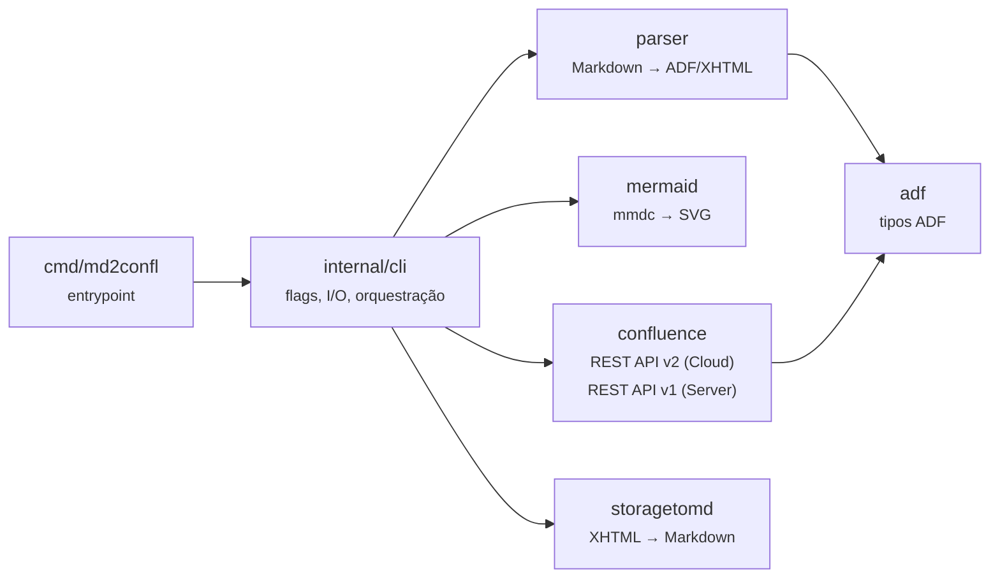
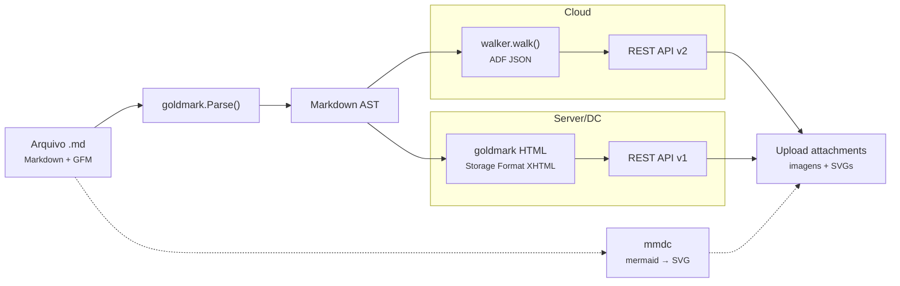

<!-- confluence-page-id: 589826 -->
# md2confl

Converte arquivos Markdown para o formato [Atlassian Document Format (ADF)](https://developer.atlassian.com/cloud/jira/platform/apis/document/structure/) e publica no Confluence Cloud ou Server/Data Center.

> **Documentação publicada no Confluence:** [fmnapoli.atlassian.net/wiki/spaces/DDS/pages/589826/md2confl](https://fmnapoli.atlassian.net/wiki/spaces/DDS/pages/589826/md2confl) — este próprio README e os guias em `docs/` são publicados automaticamente via CI usando o md2confl.

## Visão geral

O Confluence Cloud armazena conteúdo de páginas no formato ADF (Atlassian Document Format) — um JSON hierárquico de nós (headings, parágrafos, tabelas, etc.) e marcas (bold, italic, link, etc.). Escrever ADF manualmente é verboso e propenso a erros.

O `md2confl` resolve isso:

1. **Converte** Markdown (com extensões GFM — tabelas, strikethrough, task lists, autolinks — além de emojis, GitHub alerts, superscript e `
`) para ADF JSON (Cloud) ou Storage Format XHTML (Server/DC), usando o parser [goldmark](https://github.com/yuin/goldmark).

2. **Publica** páginas no Confluence Cloud (REST API v2 + ADF) ou Server/Data Center (REST API v1 + Storage Format) com `--server`.

3. **Importa** páginas do Confluence para Markdown via `md2confl pull` — suporta Cloud (ADF → Markdown) e Server/DC (Storage Format → Markdown) com download de attachments.

4. **Sincroniza** hierarquias de diretórios como árvores de páginas — cada pasta vira uma página pai, cada `.md` vira uma página filha.

5. **Atualiza de forma idempotente** — marcadores `<!-- confluence-page-id: XXXXX -->` escritos no topo do Markdown permitem re-publicações que atualizam a mesma página sem duplicar. Páginas sem alterações são automaticamente ignoradas (skip unchanged).

6. **Lida com imagens locais** — referências a imagens locais (``) são automaticamente enviadas como attachments e vinculadas à página.

7. **Renderiza diagramas Mermaid** — blocos `mermaid` são pré-renderizados para SVG via `mmdc` (mermaid-cli) durante o publish e enviados como imagens. Funciona tanto em Cloud quanto em Server/DC.

8. **Publica em paralelo** — documentos, uploads de imagens, renderização de diagramas e resolução de links são processados concorrentemente via goroutines (`--concurrency` configurável).

9. **Resiliente a falhas transitórias** — retry automático com exponential backoff para rate limits (429) e erros de servidor (5xx), com logging estruturado via `--verbose`.

10. **Custom User-Agent** — suporta `--user-agent` para ambientes com proxies/WAF que filtram por User-Agent (ex: Cloudflare).

## Arquitetura

| Pacote | Visibilidade | Responsabilidade |
|--------|-------------|-----------------|
| `adf` | Público | Tipos de dados ADF — `Document`, `Node`, `Mark`. Representa o envelope JSON `{"version":1, "type":"doc", "content":[...]}` e a árvore de nós com atributos e marcas inline. |
| `parser` | Público | Converte `[]byte` Markdown para `*adf.Document` (Cloud) ou Storage Format XHTML (Server/DC). Usa goldmark com extensões GFM, emoji e superscript. Para Cloud: AST walker com stack gera árvore ADF. Para Server/DC: goldmark HTML renderer com extensões Confluence (macros `ac:structured-macro` para code blocks, tabelas com classes `confluenceTable`, painéis para GitHub alerts). |
| `storagetomd` | Público | Converte Confluence Storage Format (XHTML) para Markdown. Suporta macros Confluence (`ac:structured-macro`, `ac:link`, `ac:image`), painéis (→ GitHub alerts), code blocks com linguagem, tabelas, listas, e imagens como attachments. Usado pelo subcomando `pull --server`. |
| `mermaid` | Público | Renderiza diagramas Mermaid para SVG via `mmdc` (mermaid-cli). Verifica disponibilidade do binário, gera nomes de arquivo determinísticos via SHA256, configura puppeteer para ambientes Docker/CI. Timeout de 60s por renderização. |
| `confluence` | Público | Clientes REST API para Confluence. `Client` (Cloud, API v2 + ADF) e `ServerClient` (Server/DC, API v1 + Storage Format). Ambos com resolve space, CRUD de páginas, busca por título, upload de attachments, download de attachments. Retry automático com exponential backoff para 429/5xx. Custom User-Agent via config. |
| `internal/cli` | Interno | Orquestração CLI: parsing de flags, resolução de credenciais (flags > env vars), modos de operação (dry-run, output file, publish, pull), processamento de diretórios, renderização de mermaid, upload de imagens locais, escrita de marcadores page-id. Suporta Cloud e Server/DC (`--server`). Publicação paralela via errgroup (`--concurrency`), skip de páginas inalteradas, logging estruturado (`--verbose`). |

### Fluxo de dados

**Detalhes do walker:** O walker visita cada nó da AST duas vezes (`entering=true` e `entering=false`). Na entrada, faz `push()` na stack para abrir um escopo de filhos. Na saída, faz `pop()` para coletar os filhos e `append()` para adicionar o nó completo ao pai. Para nós inline com formatação (bold, italic, etc.), aplica marks em vez de criar nós wrapper. Nós leaf (imagens, breaks) usam `WalkSkipChildren` para evitar travessia desnecessária.

## Documentação

| Página | Descrição |
|--------|-----------|
| [Quick Start](docs/quickstart.md) | Tutorial: instalar → converter → publicar primeira página |
| [Instalação](docs/instalacao.md) | go install, build manual, Docker, variáveis de ambiente, API token |
| [Uso e Referência](docs/referencia.md) | Flags (`--verbose`, `--concurrency`), restrições, exit codes, mapeamento Markdown → ADF |
| [Configuração](docs/configuracao.md) | Arquivo `.md2confl.yml`, auto-discovery, precedência |
| [Publicação](docs/publicacao.md) | Publicação paralela, skip unchanged, retry, warnings, modo pasta, Mermaid, imagens |
| [Server/Data Center](docs/server-dc.md) | Suporte a Confluence Server/DC: `--server`, Storage Format, pull, custom User-Agent |
| [Desenvolvimento](docs/desenvolvimento.md) | Pré-requisitos, Makefile, testes (golden, mock, race), estrutura |
| [CI/CD](docs/ci-cd.md) | GitHub Actions, govulncheck, GoReleaser |
| [Componentes ADF](docs/componentes.md) | Showcase: todos os elementos Markdown → Confluence |

## Licença

[Apache License 2.0](LICENSE)
