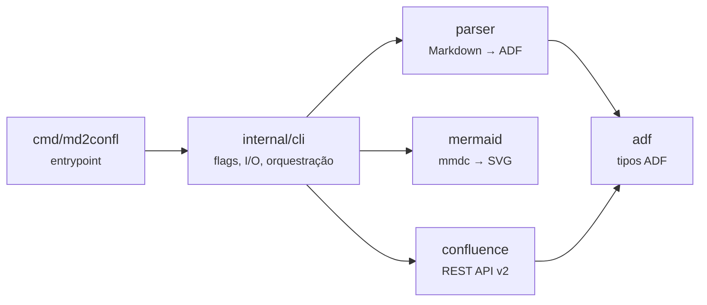
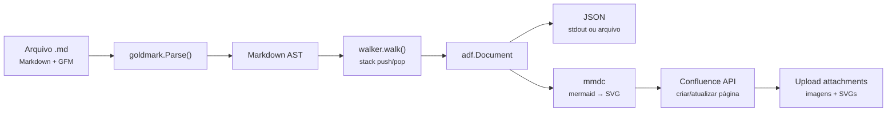

<!-- confluence-page-id: 589826 -->
# md2confl

Converte arquivos Markdown para o formato [Atlassian Document Format (ADF)](https://developer.atlassian.com/cloud/jira/platform/apis/document/structure/) e publica diretamente no Confluence Cloud.

> **Documentação publicada no Confluence:** [fmnapoli.atlassian.net/wiki/spaces/DDS/pages/589826/md2confl](https://fmnapoli.atlassian.net/wiki/spaces/DDS/pages/589826/md2confl) — este próprio README e os guias em `docs/` são publicados automaticamente via CI usando o md2confl.

## Visão geral

O Confluence Cloud armazena conteúdo de páginas no formato ADF (Atlassian Document Format) — um JSON hierárquico de nós (headings, parágrafos, tabelas, etc.) e marcas (bold, italic, link, etc.). Escrever ADF manualmente é verboso e propenso a erros.

O `md2confl` resolve isso:

1. **Converte** Markdown (com extensões GFM — tabelas, strikethrough, autolinks) para ADF JSON válido, usando o parser [goldmark](https://github.com/yuin/goldmark) para construir a AST e um walker próprio para gerar a árvore ADF.

2. **Publica** páginas no Confluence Cloud via REST API v2, com autenticação Basic (email + API token).

3. **Sincroniza** hierarquias de diretórios como árvores de páginas — cada pasta vira uma página pai, cada `.md` vira uma página filha.

4. **Atualiza de forma idempotente** — marcadores `<!-- confluence-page-id: XXXXX -->` escritos no topo do Markdown permitem re-publicações que atualizam a mesma página sem duplicar.

5. **Lida com imagens locais** — referências a imagens locais (``) são automaticamente enviadas como attachments e vinculadas à página.

6. **Renderiza diagramas Mermaid** — blocos `mermaid` são pré-renderizados para SVG via `mmdc` (mermaid-cli) durante o publish e enviados como imagens. A imagem Docker inclui tudo necessário (`md2confl` + Node.js + Chromium + mmdc).

## Arquitetura

| Pacote | Visibilidade | Responsabilidade |
|--------|-------------|-----------------|
| `adf` | Público | Tipos de dados ADF — `Document`, `Node`, `Mark`. Representa o envelope JSON `{"version":1, "type":"doc", "content":[...]}` e a árvore de nós com atributos e marcas inline. |
| `parser` | Público | Converte `[]byte` Markdown para `*adf.Document`. Usa goldmark com extensão GFM para fazer parse, e um AST walker com stack para construir a árvore ADF. Entrada: bytes Markdown. Saída: documento ADF pronto para serializar. |
| `mermaid` | Público | Renderiza diagramas Mermaid para SVG via `mmdc` (mermaid-cli). Verifica disponibilidade do binário, gera nomes de arquivo determinísticos via SHA256 e configura puppeteer para ambientes Docker/CI. |
| `confluence` | Público | Cliente REST API v2 do Confluence Cloud. Resolve space key → ID, cria/atualiza páginas, busca por título, faz upload de attachments. Todos os erros são `*APIError` com categoria, status HTTP e hint acionável. |
| `internal/cli` | Interno | Orquestração CLI: parsing de flags, resolução de credenciais (flags > env vars), modos de operação (dry-run, output file, publish), processamento de diretórios, renderização de mermaid, upload de imagens locais, escrita de marcadores page-id. Não é API pública — só `main.go` importa. |

### Fluxo de dados

**Detalhes do walker:** O walker visita cada nó da AST duas vezes (`entering=true` e `entering=false`). Na entrada, faz `push()` na stack para abrir um escopo de filhos. Na saída, faz `pop()` para coletar os filhos e `append()` para adicionar o nó completo ao pai. Para nós inline com formatação (bold, italic, etc.), aplica marks em vez de criar nós wrapper. Nós leaf (imagens, breaks) usam `WalkSkipChildren` para evitar travessia desnecessária.

## Documentação

| Página | Descrição |
|--------|-----------|
| [Quick Start](docs/quickstart.md) | Tutorial: instalar → converter → publicar primeira página |
| [Instalação](docs/instalacao.md) | go install, build manual, Docker, variáveis de ambiente, API token |
| [Uso e Referência](docs/referencia.md) | Exemplos de uso, flags, restrições entre flags, exit codes |
| [Configuração](docs/configuracao.md) | Arquivo `.md2confl.yml`, auto-discovery, precedência |
| [Publicação](docs/publicacao.md) | Fluxo de publicação, marcadores, modo pasta, Mermaid, imagens |
| [Desenvolvimento](docs/desenvolvimento.md) | Pré-requisitos, Makefile, testes, golden files, estrutura |
| [CI/CD](docs/ci-cd.md) | Automatizar publicação com GitHub Actions |

## Licença

[Apache License 2.0](LICENSE)
