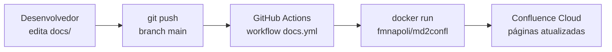

<!-- confluence-page-id: 1376257 -->
# CI/CD

Automatize a publicação de documentação no Confluence com GitHub Actions (ou qualquer CI que suporte Docker).

## GitHub Actions

### Workflow de publicação

O workflow abaixo publica automaticamente no Confluence sempre que arquivos de documentação são alterados na branch `main`:

```yaml
# .github/workflows/docs.yml
name: Docs
on:
  push:
    branches: [main]
    paths:
      - 'README.md'
      - 'docs/**'
      - '.md2confl.yml'

jobs:
  publish:
    runs-on: ubuntu-latest
    steps:
      - uses: actions/checkout@v4

      - name: Publish to Confluence
        run: |
          docker run --rm \
            -v "${{ github.workspace }}:/workspace" \
            -e CONFLUENCE_URL="${{ secrets.CONFLUENCE_URL }}" \
            -e CONFLUENCE_EMAIL="${{ secrets.CONFLUENCE_EMAIL }}" \
            -e CONFLUENCE_TOKEN="${{ secrets.CONFLUENCE_TOKEN }}" \
            fmnapoli/md2confl:latest \
            --config .md2confl.yml
```

### Secrets necessários

Configure os seguintes secrets no repositório GitHub (`Settings → Secrets and variables → Actions`):

| Secret | Valor |
|--------|-------|
| `CONFLUENCE_URL` | URL base do Confluence (ex: `https://site.atlassian.net`) |
| `CONFLUENCE_EMAIL` | E-mail da conta Atlassian |
| `CONFLUENCE_TOKEN` | API token da Atlassian |

Para gerar o API token, veja [Instalação → Como obter o API token](instalacao.md#como-obter-o-api-token-da-atlassian).

## Arquivo de configuração

O workflow usa o arquivo `.md2confl.yml` na raiz do repositório para saber quais documentos publicar. Exemplo:

```yaml
# .md2confl.yml
url: https://site.atlassian.net
space: DEVOPS
email: user@example.com
force: true
write-marker: true

documents:
  - input: README.md
    title: "Meu Projeto"

  - input: docs/quickstart.md
    parent-id: "12345"

  - input: docs/api.md
    parent-id: "12345"
```

Para detalhes sobre o formato, veja [Configuração](configuracao.md).

## Publicação inicial

Antes do CI funcionar, é necessário fazer uma publicação manual para gerar os marcadores `confluence-page-id` nos arquivos Markdown:

```bash
# 1. Configurar credenciais
export CONFLUENCE_URL="https://site.atlassian.net"
export CONFLUENCE_EMAIL="user@example.com"
export CONFLUENCE_TOKEN="seu-api-token"

# 2. Publicar via Docker (inclui suporte a Mermaid)
docker run --rm -v "$(pwd):/workspace" \
  -e CONFLUENCE_URL -e CONFLUENCE_EMAIL -e CONFLUENCE_TOKEN \
  fmnapoli/md2confl:latest \
  --config .md2confl.yml

# 3. Verificar que os marcadores foram escritos
head -1 README.md docs/*.md

# 4. Commit dos marcadores
git add README.md docs/
git commit -m "docs: add confluence page-id markers"
git push
```

Após o push, o workflow de CI assume e publica automaticamente a cada mudança.

## Fluxo completo



1. Desenvolvedor edita arquivos em `docs/` ou `README.md`
2. Push para `main` dispara o workflow
3. Workflow roda `md2confl` via Docker com o config YAML
4. Páginas no Confluence são criadas/atualizadas automaticamente

## Variantes

### Com output JSON (para logs estruturados)

```yaml
      - name: Publish to Confluence
        run: |
          docker run --rm \
            -v "${{ github.workspace }}:/workspace" \
            -e CONFLUENCE_URL="${{ secrets.CONFLUENCE_URL }}" \
            -e CONFLUENCE_EMAIL="${{ secrets.CONFLUENCE_EMAIL }}" \
            -e CONFLUENCE_TOKEN="${{ secrets.CONFLUENCE_TOKEN }}" \
            fmnapoli/md2confl:latest \
            --config .md2confl.yml --json
```

### Publicar apenas um documento específico

```yaml
      - name: Publish README only
        run: |
          docker run --rm \
            -v "${{ github.workspace }}:/workspace" \
            -e CONFLUENCE_URL="${{ secrets.CONFLUENCE_URL }}" \
            -e CONFLUENCE_EMAIL="${{ secrets.CONFLUENCE_EMAIL }}" \
            -e CONFLUENCE_TOKEN="${{ secrets.CONFLUENCE_TOKEN }}" \
            fmnapoli/md2confl:latest \
            --config .md2confl.yml --input README.md
```

### Dry-run em pull requests

```yaml
name: Docs Preview
on:
  pull_request:
    paths:
      - 'README.md'
      - 'docs/**'
      - '.md2confl.yml'

jobs:
  preview:
    runs-on: ubuntu-latest
    steps:
      - uses: actions/checkout@v4

      - name: Preview Confluence changes
        run: |
          docker run --rm \
            -v "${{ github.workspace }}:/workspace" \
            -e CONFLUENCE_URL="${{ secrets.CONFLUENCE_URL }}" \
            -e CONFLUENCE_EMAIL="${{ secrets.CONFLUENCE_EMAIL }}" \
            -e CONFLUENCE_TOKEN="${{ secrets.CONFLUENCE_TOKEN }}" \
            fmnapoli/md2confl:latest \
            --config .md2confl.yml --dry-run
```
