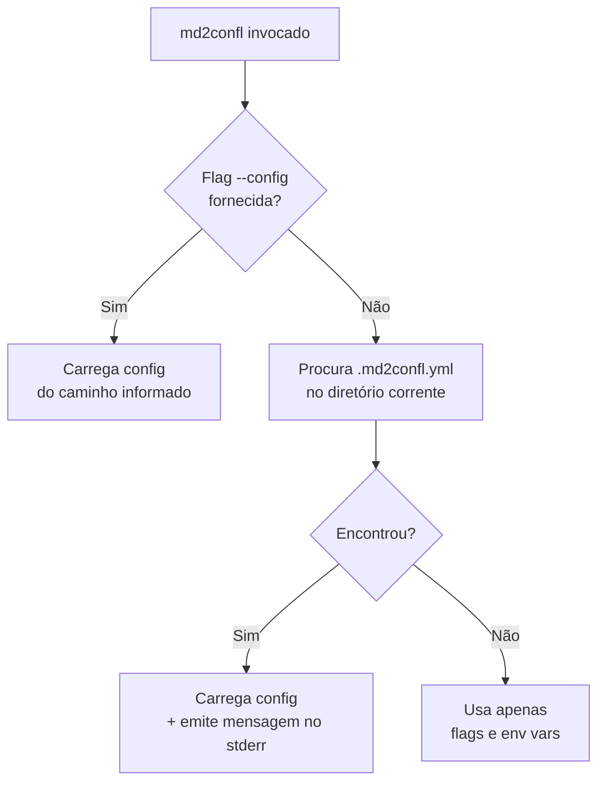
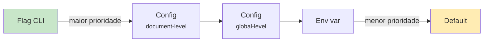

<!-- confluence-page-id: 1245185 -->
# Configuração

O `md2confl` suporta um arquivo de configuração YAML (`.md2confl.yml`) que centraliza defaults globais e mapeia documentos para publicação ou conversão. Isso elimina a repetição de flags como `--url`, `--space`, `--email`, etc.

## Formato do config

```yaml
# .md2confl.yml

# Defaults globais — aplicados a todos os documentos
url: https://site.atlassian.net
space: DEVOPS
email: user@example.com
parent-id: "12345"
force: true
write-marker: true

# Documentos — cada entry mapeia input → destino
documents:
  # Publish: input → Confluence
  - input: docs/architecture.md
    title: "Architecture Overview"
    # herda url, space, email, parent-id do global

  - input: docs/runbook.md
    title: "Operations Runbook"
    space: OPS                 # override do global
    parent-id: "67890"

  # Convert: input → arquivo JSON
  - input: docs/spec.md
    output: dist/spec.json     # sem publish — apenas converte

  - input: docs/onboarding.md
    # title derivado do H1 (comportamento default)
```

**Regras:**
- `token` **não pode** estar no config (segurança) — sempre via `CONFLUENCE_TOKEN` ou `--token`
- Se entry tem `output:` → modo convert (gera JSON); se não → modo publish
- `documents` é uma lista ordenada (processados em sequência)
- Cada entry precisa apenas de `input` — tudo mais é opcional e herda do global
- Caminhos relativos são resolvidos a partir do diretório do config

## Uso com config

```bash
# Processar TODOS os documents do config
md2confl --config .md2confl.yml

# Filtrar por um input específico
md2confl --config .md2confl.yml --input docs/runbook.md

# Override via flag (flag > config)
md2confl --config .md2confl.yml --space STAGING

# Preview sem publicar
md2confl --config .md2confl.yml --dry-run

# Sem config — comportamento atual inalterado
md2confl --input doc.md --publish --url https://... --space DEVOPS
```

## Auto-discovery



Sem `--config` explícito, o md2confl procura `.md2confl.yml` (ou `.md2confl.yaml`) no diretório corrente. Se encontrar, carrega silenciosamente e emite uma mensagem no stderr:

```
Using config: /path/to/.md2confl.yml
```

Se não encontrar, segue o fluxo normal baseado em flags.

## Precedência



## Input de diretório

Além de arquivos individuais, o `input` pode apontar para um diretório. O md2confl processa todos os `.md` recursivamente, criando uma hierarquia de páginas no Confluence (veja [Publicação → Modo pasta](publicacao.md#modo-pasta)):

```yaml
documents:
  - input: README.md
    title: "Meu Projeto"

  - input: docs/
    parent-id: "12345"    # publica toda a pasta como árvore de páginas
```

O `README.md` dentro da pasta vira a página pai do diretório. Os demais `.md` viram páginas filhas. Subdiretórios são processados recursivamente.

## Resolução de links inter-documento

Quando o config tem múltiplos documentos (ou diretórios), o md2confl resolve automaticamente links relativos entre eles. Por exemplo, se `README.md` contém `[Quick Start](docs/quickstart.md)`, após a publicação o link é substituído pela URL da página correspondente no Confluence.

- Links para arquivos não publicados são mantidos inalterados
- Fragments são preservados: `instalacao.md#como-obter` → `https://.../Instalação#como-obter`
- A contagem de links resolvidos é exibida no output: `Resolved 7 inter-document link(s) in "README.md"`
- Em `--dry-run`, exibe preview: `Dry-run: would resolve 7 inter-document link(s) in "README.md"`

## Exemplo: publicar múltiplos documentos

Um caso comum é manter a documentação no repositório e publicar todas as páginas com um único comando:

```yaml
# .md2confl.yml
url: https://site.atlassian.net
space: DEVOPS
email: user@example.com
force: true
write-marker: true

documents:
  - input: README.md
    title: "Meu Projeto"

  - input: docs/
    parent-id: "12345"    # publica toda a pasta como árvore
```

```bash
# Publica tudo de uma vez
md2confl --config .md2confl.yml
```

Links entre `README.md` e os arquivos em `docs/` são resolvidos automaticamente para URLs do Confluence.
