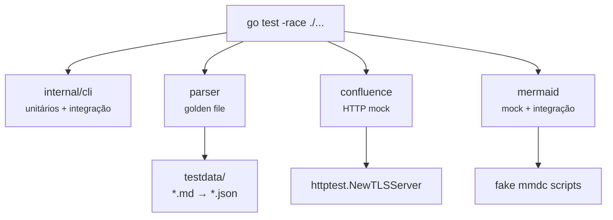
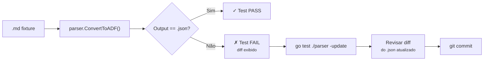

<!-- confluence-page-id: 1343489 -->
# Desenvolvimento

## Pré-requisitos

- Go 1.25+
- Make (opcional, para usar os targets)
- [golangci-lint](https://golangci-lint.run/) v2+ (para `make lint` / `make verify`)
- [GoReleaser](https://goreleaser.com/) v2+ (para `make release`)
- `mmdc` ([@mermaid-js/mermaid-cli](https://github.com/mermaid-js/mermaid-cli)) — necessário apenas para publish com blocos mermaid. Instale via `npm install -g @mermaid-js/mermaid-cli` ou use a imagem Docker que já inclui tudo.
- Docker (opcional, para build da imagem ou uso via `docker run`)

## Comandos do Makefile

```bash
make build          # Compila bin/md2confl com versão via git describe
make test           # go test -race ./...
make lint           # golangci-lint run ./...
make test-coverage  # Testes com race detector + enforcement de cobertura mínima
make verify         # lint + test-coverage (usado no CI)
make release        # goreleaser snapshot local (gera binários em dist/)
make docker         # Build da imagem Docker com Node.js + Chromium + mmdc
make license-check  # Verifica que todo .go tem header SPDX Apache-2.0
make clean          # Remove bin/, dist/, coverage.out
```

## Testes

```bash
# Rodar todos os testes
go test ./...

# Com race detector
go test -race ./...

# Verbose para um pacote
go test -v ./parser

# Apenas um caso
go test -v -run TestConvertToADF/basic ./parser
```

O projeto tem 3 suítes de testes:

| Pacote | Tipo de testes | O que cobre |
|--------|---------------|-------------|
| `internal/cli` | Unitários | Parsing de flags, restrições de flags, exit codes, derivação de título, extração de page-id, detecção de imagens locais, patching de imagens, detecção e patching de blocos mermaid, output texto/JSON, dry-run, conversão de diretórios, `--verbose`, `--concurrency` (validação de limites), `adfUnchanged` (skip de páginas inalteradas), `addWarning` (thread-safety), `printWarningSummary` |
| `parser` | Golden file | Conversão Markdown → ADF para todos os cenários suportados (basic, codeblock, table, mermaid, multi-mermaid, empty, nested-list, combined-marks) |
| `confluence` | HTTP mock | Todas as operações da API com `httptest.NewTLSServer`: ResolveSpaceID, CreatePage, GetPage, UpdatePage, FindByTitle, UploadAttachment, erros de autenticação, retry com exponential backoff (429/5xx) |
| `mermaid` | Unitário + mock + integração | Verificação de disponibilidade do mmdc (`EnsureAvailable` found/not-found), renderização para SVG (skip se mmdc ausente), idempotência de hash, timeout de subprocess (fake mmdc com `sleep`), falha de renderização (fake mmdc com exit 1) |



## Golden files

Os testes do parser usam o pattern golden file: cada `parser/testdata/<nome>.md` tem um `<nome>.json` correspondente com o ADF esperado. O teste converte o `.md` e compara byte-a-byte com o `.json`.

```
parser/testdata/
├── basic.md          Headings, bold, italic, code, link, strike, lists, blockquote, rule
├── basic.json
├── codeblock.md      Fenced code blocks (go, python, sem linguagem)
├── codeblock.json
├── table.md          Tabela GFM com header e body
├── table.json
├── mermaid.md        Diagrama Mermaid em code fence
├── mermaid.json
├── multi-mermaid.md  Múltiplos diagramas Mermaid com texto entre eles
├── multi-mermaid.json
├── nested-list.md    Listas aninhadas (bullet dentro de bullet, ordered dentro de bullet)
├── nested-list.json
├── combined-marks.md Bold+italic, strikethrough+bold, bold links, marcas combinadas
├── combined-marks.json
├── empty.md          Arquivo vazio
└── empty.json
```



Para atualizar golden files após mudanças intencionais no output:

```bash
go test ./parser -update
```

> **Atenção:** sempre revise o diff do `.json` atualizado antes de commitar. Golden files atualizados sem revisão podem mascarar regressões.

## Estrutura do projeto

```
cmd/md2confl/         Entrypoint — main.go chama cli.Run()
internal/cli/         Orquestração CLI — flags, I/O, publicação, modo diretório
  cli.go              Lógica principal — parsing, publish, dir tree, mermaid rendering
  config.go           Config file — structs, loading, auto-discovery, apply
  output.go           Formatação de resultado e erro (texto + JSON)
  cli_test.go         Testes unitários e integração
  config_test.go      Testes unitários do config
adf/                  Tipos ADF (Document, Node, Mark)
  types.go            Structs + construtores
parser/               Conversão Markdown → ADF
  parser.go           goldmark + AST walker com stack
  parser_test.go      Golden file tests
  testdata/           Fixtures .md + .json
confluence/           Cliente REST API v2
  client.go           HTTP client, CRUD de páginas, upload de attachments
  errors.go           APIError com categorias e hints
  client_test.go      Testes com httptest.NewTLSServer
mermaid/              Renderização de diagramas Mermaid para SVG
  mermaid.go          Wrapper do mmdc (mermaid-cli)
  mermaid_test.go     Testes unitários e integração
Dockerfile            Imagem Docker multi-stage (Go + Node.js + Chromium + mmdc)
```
