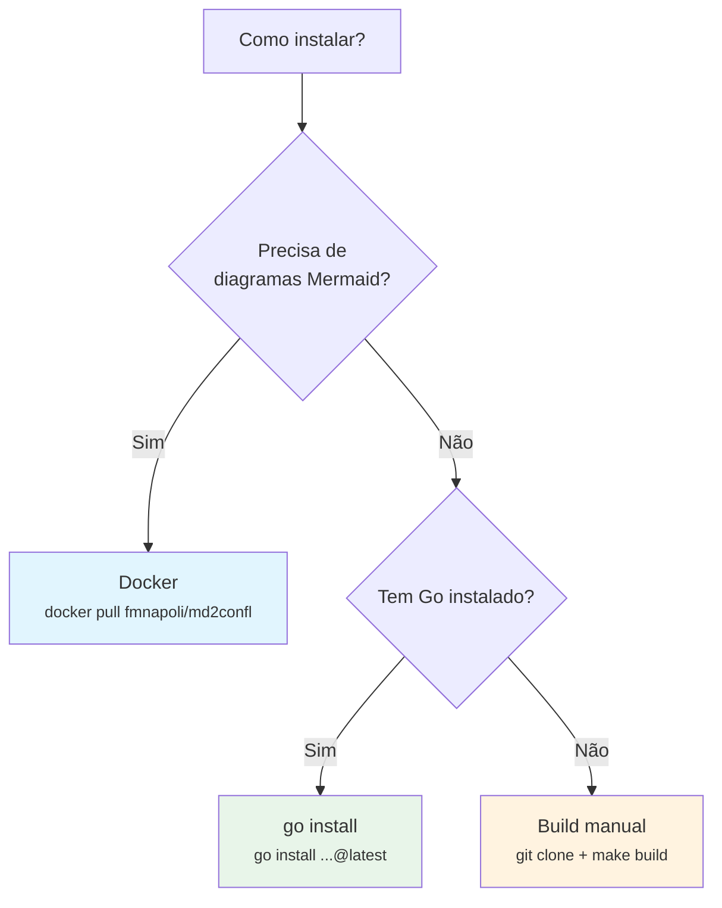
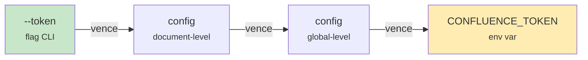

<!-- confluence-page-id: 327875 -->
# Instalação



## Via `go install`

```bash
go install github.com/fmnapoli/md2confl/cmd/md2confl@latest
```

Isso compila e instala o binário em `$GOPATH/bin/md2confl` (ou `$HOME/go/bin/md2confl`).

## Build manual

```bash
git clone https://github.com/fmnapoli/md2confl.git
cd md2confl
make build
# binário em bin/md2confl
```

O `make build` injeta a versão via ldflags a partir de `git describe`, então o binário reporta a tag/commit correto com `--version`.

## Via Docker (recomendado para Mermaid)

A imagem Docker inclui `md2confl` + Node.js + Chromium + `mmdc`, sem necessidade de instalar nada além do Docker:

```bash
docker pull fmnapoli/md2confl:latest
```

Uso:

```bash
# Converter para ADF (stdout)
docker run --rm -v "$(pwd):/workspace" fmnapoli/md2confl --input doc.md

# Publicar no Confluence (diagramas mermaid são renderizados automaticamente)
docker run --rm -v "$(pwd):/workspace" \
  -e CONFLUENCE_URL="https://site.atlassian.net" \
  -e CONFLUENCE_EMAIL="user@example.com" \
  -e CONFLUENCE_TOKEN="seu-api-token" \
  fmnapoli/md2confl --input doc.md --publish --space DEVOPS --title "Minha Página"
```

Build local da imagem:

```bash
make docker
```

## Variáveis de ambiente

| Variável | Flag equivalente | Descrição |
|----------|-----------------|-----------|
| `CONFLUENCE_URL` | `--url` | URL base do Confluence (Cloud ou Server/DC) |
| `CONFLUENCE_EMAIL` | `--email` | E-mail (Cloud) ou username (Server/DC) |
| `CONFLUENCE_TOKEN` | `--token` | API token (Cloud) ou password/PAT (Server/DC) |



**Precedência:** flag > config (document-level) > config (global-level) > variável de ambiente. Se ambos estão definidos, o nível mais específico vence.

> **Segurança:** prefira `CONFLUENCE_TOKEN` via variável de ambiente. Passar o token via `--token` na linha de comando o expõe no histórico do shell e na lista de processos (`ps`). O md2confl emite um warning no stderr quando detecta que o token foi passado via flag.

**Exemplo com env vars:**

```bash
export CONFLUENCE_URL="https://site.atlassian.net"
export CONFLUENCE_EMAIL="user@example.com"
export CONFLUENCE_TOKEN="seu-api-token"

# Agora só precisa das flags específicas da operação:
md2confl --input doc.md --publish --space DEVOPS --title "Minha Página"
```

## Autenticação

### Confluence Cloud

O `md2confl` usa autenticação Basic (email + API token) para acessar a API do Confluence Cloud. Para gerar seu token:

1. Acesse [https://id.atlassian.com/manage-profile/security/api-tokens](https://id.atlassian.com/manage-profile/security/api-tokens)
2. Clique em **Create API token**
3. Dê um nome descritivo (ex: `md2confl`)
4. Clique em **Create** e copie o token gerado

> **Importante:** o token é exibido apenas uma vez. Se perder, será necessário revogar e criar um novo.

```bash
export CONFLUENCE_URL="https://site.atlassian.net"
export CONFLUENCE_EMAIL="user@example.com"
export CONFLUENCE_TOKEN="seu-api-token"
```

### Confluence Server/Data Center

No Server/DC, a autenticação usa username + password ou Personal Access Token (PAT):

**Com password:**

```bash
export CONFLUENCE_URL="https://confluence.empresa.com"
export CONFLUENCE_EMAIL="seu-usuario"       # username, não email
export CONFLUENCE_TOKEN="sua-senha"
```

**Com Personal Access Token (PAT):**

Se o Confluence Server tiver PATs habilitados (Configurações do perfil → Tokens de acesso pessoal):

```bash
export CONFLUENCE_URL="https://confluence.empresa.com"
export CONFLUENCE_EMAIL="seu-usuario"
export CONFLUENCE_TOKEN="seu-pat"
```

> **Nota:** o md2confl usa as mesmas variáveis de ambiente para Cloud e Server/DC. A diferença está no conteúdo: email + API token (Cloud) vs username + password/PAT (Server/DC).

Para uso em CI/CD, armazene o token como secret (ex: GitHub Actions, GitLab CI) e injete via variável de ambiente. Nunca commite tokens em repositórios.
