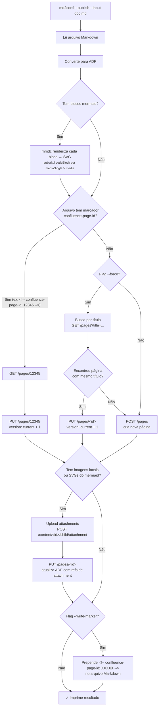
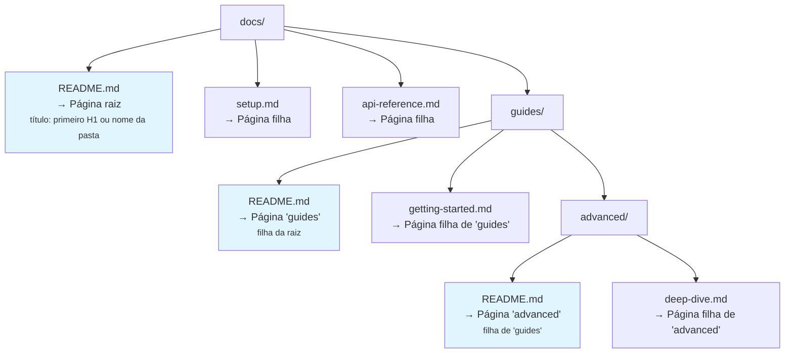

<!-- confluence-page-id: 1277953 -->
# Publicação

## Fluxo de publicação

Quando `--publish` é usado, o md2confl decide entre criar ou atualizar uma página com base em três critérios:



## Marcador de page ID

O marcador `<!-- confluence-page-id: XXXXX -->` é um comentário HTML que o md2confl insere no topo do arquivo Markdown quando `--write-marker` é usado. Ele permite:

- **Idempotência:** re-executar o mesmo comando atualiza a página em vez de criar uma cópia.
- **Rastreabilidade:** o arquivo Markdown carrega a referência direta para a página no Confluence.
- **Regex:** o formato é validado por `<!--\s*confluence-page-id:\s*(\d+)\s*-->`, então espaços extras são tolerados.

Se o marcador já existe no arquivo, ele é atualizado (não duplicado). Se não existe, é adicionado na primeira linha.

## Modo pasta

Quando `--input` aponta para um diretório, o `md2confl` mapeia a hierarquia de pastas para uma árvore de páginas no Confluence:



### Regras detalhadas

| Elemento | Comportamento |
|----------|--------------|
| `README.md` em um diretório | Vira a **página pai** daquele nível. O título é extraído do primeiro `# Heading` do README; se não houver heading, usa o nome do diretório. |
| Outros `*.md` no diretório | Viram **páginas filhas** da página criada pelo README (ou pela página vazia do diretório). O título de cada uma segue a mesma lógica: primeiro H1, senão nome do arquivo sem extensão. |
| Subdiretórios | Processados **recursivamente** com a mesma lógica. A página do subdiretório é filha da página do diretório pai. |
| Diretório sem `README.md` | Uma **página vazia** é criada como container para agrupar as filhas. O título é o nome do diretório. |
| `--title` no diretório raiz | A flag `--title` só se aplica à página raiz da hierarquia. As demais usam a lógica automática. |
| `--parent-id` | Define o pai da página raiz da hierarquia no Confluence. |
| `--write-marker` | Escreve o marcador `confluence-page-id` em **cada** arquivo `.md` processado. |
| Arquivos não-.md | Ignorados silenciosamente. |

### Exemplo concreto

Dado a estrutura:

```
docs/
├── README.md          # "# Documentação do Projeto"
├── instalacao.md      # "# Guia de Instalação"
├── faq.md             # (sem heading → título "faq")
└── guias/
    ├── README.md      # "# Guias Avançados"
    └── deploy.md      # "# Deploy em Produção"
```

Comando:

```bash
md2confl --input docs/ --publish --space DEVOPS --parent-id 999
```

Resultado no Confluence:

```
Página 999 (pai)
└── Documentação do Projeto        ← docs/README.md
    ├── Guia de Instalação         ← docs/instalacao.md
    ├── faq                        ← docs/faq.md
    └── Guias Avançados            ← docs/guias/README.md
        └── Deploy em Produção     ← docs/guias/deploy.md
```

## Mermaid no Confluence

O Confluence Cloud **não renderiza Mermaid nativamente**. O `md2confl` resolve isso de duas formas:

### Modo publish (com `--publish`)

Quando há blocos `mermaid` no Markdown e `mmdc` está disponível no PATH, o md2confl **pré-renderiza cada diagrama para SVG** antes de publicar. Os SVGs são enviados como attachments (usando o mesmo pipeline de imagens locais).

```bash
# Com mmdc instalado localmente
md2confl --input doc.md --publish --space DEVOPS ...

# Ou via Docker (mmdc já incluído)
docker run --rm -v "$(pwd):/workspace" \
  -e CONFLUENCE_URL=... -e CONFLUENCE_EMAIL=... -e CONFLUENCE_TOKEN=... \
  fmnapoli/md2confl --input doc.md --publish --space DEVOPS
```

Se o Markdown contém blocos mermaid e `mmdc` **não** está instalado, o md2confl retorna erro com instruções de instalação.

### Modo convert/dry-run (sem `--publish`)

Em modos de conversão (`--output`, `--dry-run`, stdout), os blocos mermaid são mantidos como `codeBlock` no ADF, preservando o código fonte:

```json
{
  "type": "codeBlock",
  "attrs": { "language": "mermaid" },
  "content": [
    { "type": "text", "text": "graph TD;\n    A-->B;\n    A-->C;" }
  ]
}
```

**Alternativa:** se preferir não usar pré-rendering, instale um app de marketplace como [Mermaid Diagrams for Confluence](https://marketplace.atlassian.com/apps/1226567) que detecta code blocks mermaid e renderiza diretamente no Confluence.

## Imagens locais

Quando o Markdown referencia imagens locais (caminhos que não começam com `http://`, `https://` ou `//`), o md2confl:

1. Converte para `mediaSingle` > `media` com `type: external` e `url: ./caminho/relativo.png`
2. Após criar/atualizar a página, faz upload de cada imagem como attachment via API v1 (`POST /content/{id}/child/attachment`)
3. Faz um segundo `PUT` na página substituindo as referências externas por `type: file` com o ID do attachment

Caminhos relativos são resolvidos a partir do diretório do arquivo Markdown. Imagens não encontradas geram um warning no stderr mas não interrompem a publicação.
