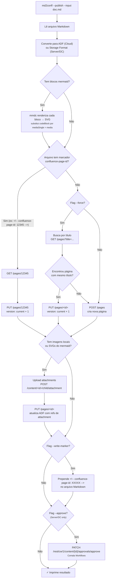
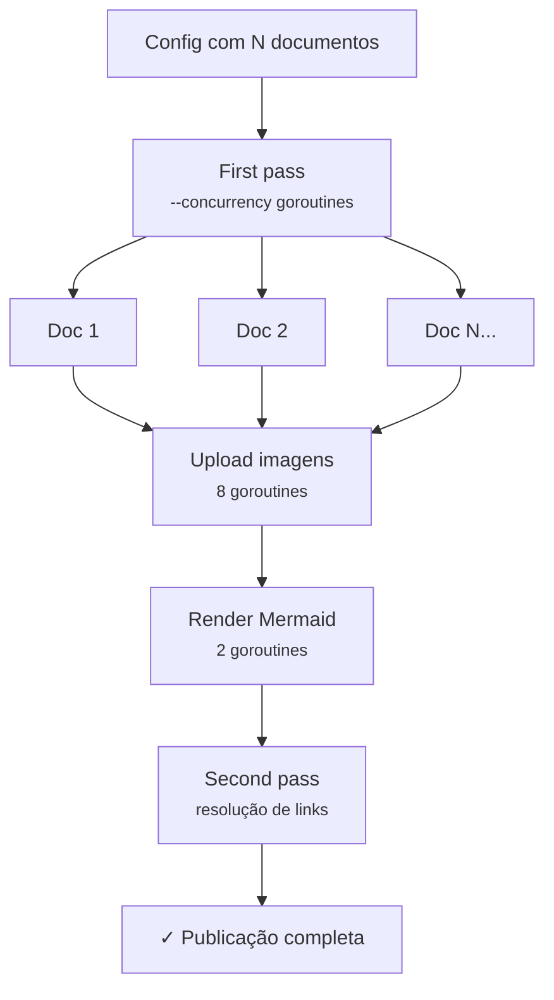
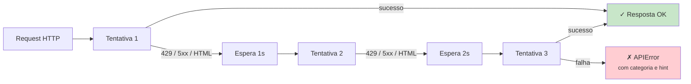
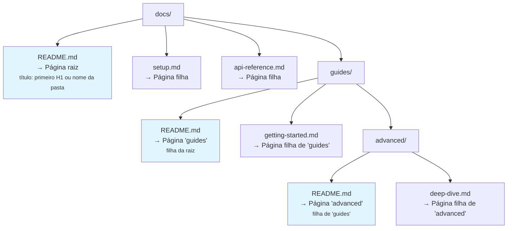

<!-- confluence-page-id: 1277953 -->
# Publicação

## Fluxo de publicação

Quando `--publish` é usado, o md2confl decide entre criar ou atualizar uma página com base em três critérios:



> **Server/Data Center:** quando `--server` é usado, o fluxo acima usa Storage Format (XHTML) em vez de ADF e a REST API v1 em vez da v2. Veja [Server/Data Center](server-dc.md) para detalhes.

## Publicação paralela

Quando múltiplos documentos são publicados (via config ou modo diretório), o md2confl processa em paralelo para maximizar performance:

| Operação | Concorrência padrão |
|----------|-------------------|
| Documentos (first pass) | `--concurrency` (default 4) |
| Upload de imagens | 8 |
| Renderização mermaid | 2 (mmdc usa Chromium headless) |
| Resolução de links (second pass) | 4 |

A flag `--concurrency` controla o paralelismo de documentos (1–16). As demais operações têm limites fixos otimizados.



## Skip de páginas inalteradas

Antes de atualizar uma página existente, o md2confl verifica se o conteúdo publicado já corresponde à fonte local. Em caso positivo a atualização é ignorada:

```
- Skipped "Quick Start" (unchanged)
```

Isso reduz chamadas à API e evita incrementar a versão da página desnecessariamente.

### Cloud (ADF)

A comparação é entre o ADF publicado (via API) e o ADF recém-gerado, após normalização JSON.

### Server/DC (Storage Format)

Comparar o HTML recém-gerado com o corpo publicado **não funciona** aqui, por dois motivos independentes:

1. O corpo publicado passou pelo **second pass**, que troca os links relativos `*.md` por URLs do Confluence, enquanto o HTML recém-gerado ainda tem os links crus.
2. O Confluence Server **reescreve o Storage Format que recebe**. Medido contra o TDN em ago/2026, comparando o corpo devolvido pela API com o HTML que a ferramenta enviou:
   - comentários HTML são descartados por inteiro;
   - macros ganham `ac:schema-version` e um `ac:macro-id` (UUID gerado no servidor — não há como reproduzi-lo localmente);
   - caracteres não-ASCII viram entidades (`Operações` → `Opera&ccedil;&otilde;es`), o que atinge praticamente toda página em pt-br.

Ou seja: o corpo publicado nunca é byte a byte igual ao gerado, com ou sem links. A consequência era republicar toda página em toda execução.

Por isso o digest da fonte fica numa **content property** da página, fora do corpo:

```json
GET /rest/api/content/{id}/property/md2conflSource
{ "value": { "digest": "791057e9…" } }
```

O digest cobre o título e o Storage Format gerado a partir do Markdown, **antes** da resolução de links. A comparação passa a ser fonte contra fonte. A property é lida junto com a página (`expand=metadata.properties.md2conflSource`, sem request extra), gravar não incrementa a versão da página, e a chave precisa ser alfanumérica — com hífen o Server responde HTTP 500 nesse expand.

> A property é sempre gravada **depois** de a escrita do corpo dar certo. O contrário deixaria uma página com digest novo e corpo velho, que a execução seguinte pularia.

Consequências práticas:

| Situação | Comportamento |
|----------|--------------|
| Markdown, título ou conversor mudaram | Página republicada |
| Só a resolução de links difere | Página pulada (o second pass já cuidou dela) |
| Página sem a property (publicada por versão anterior) | Comparação byte a byte, como antes — republica uma vez e passa a ter a property |
| Instância não guarda a property | Volta ao comportamento antigo (republica à toa, nunca pula página alterada) **e a execução avisa** |
| Página editada à mão no Confluence | **Não** é revertida enquanto o Markdown não mudar |

A cada execução, a primeira gravação de digest é relida para confirmar que o servidor guardou o valor. Se não guardou, sai um aviso nomeando a content property — sem ele o sintoma seria indistinguível de "nada mudou".

O second pass também virou idempotente. Ele não compara corpos (pelo motivo 2 acima): compara os **valores de `href`** do corpo publicado com os do corpo que ele produziria agora, que é exatamente a pergunta que lhe cabe e a única parte do documento que atravessa o sanitizador intacta. Com isso ele não reescreve nada quando os links já estão resolvidos, mas ainda corrige a página quando o link precisa apontar para outro endereço (a página de destino foi renomeada e mudou de URL) ou quando uma execução interrompida deixou links crus no corpo.

## Retry automático

O cliente HTTP faz retry automático com exponential backoff para falhas transitórias:

| Cenário | Comportamento |
|---------|--------------|
| Rate limit (429) | Respeita `Retry-After` header, senão backoff 1s → 2s → 4s |
| Erro de servidor (5xx) | Backoff 1s → 2s → 4s (máximo 3 tentativas) |
| Timeout de conexão | 30 segundos por requisição |



Com `--verbose`, cada retry é logado no stderr.

## Resumo de warnings

Ao final da execução, o md2confl exibe um resumo consolidado de warnings (imagens não encontradas, uploads falhados, etc.):

```
⚠ 2 warning(s):
  - local image not found: img/old.png
  - failed to upload diagram.svg: 413 payload too large
```

## Marcador de page ID

O marcador `<!-- confluence-page-id: XXXXX -->` é um comentário HTML que o md2confl insere no topo do arquivo Markdown quando `--write-marker` é usado. Ele permite:

- **Idempotência:** re-executar o mesmo comando atualiza a página em vez de criar uma cópia.
- **Rastreabilidade:** o arquivo Markdown carrega a referência direta para a página no Confluence.
- **Regex:** o formato é validado por `<!--\s*confluence-page-id:\s*(\d+)\s*-->`, então espaços extras são tolerados.

Se o marcador já existe no arquivo, ele é atualizado (não duplicado). Se não existe, é adicionado na primeira linha.

## Modo pasta

Quando `--input` aponta para um diretório, o `md2confl` mapeia a hierarquia de pastas para uma árvore de páginas no Confluence:



### Regras detalhadas

| Elemento | Comportamento |
|----------|--------------|
| `README.md` em um diretório | Vira a **página pai** daquele nível. O título é extraído do primeiro `# Heading` do README; se não houver heading, usa o nome do diretório. |
| Outros `*.md` no diretório | Viram **páginas filhas** da página criada pelo README (ou pela página vazia do diretório). O título de cada uma segue a mesma lógica: primeiro H1, senão nome do arquivo sem extensão. |
| Subdiretórios | Processados **recursivamente** com a mesma lógica. A página do subdiretório é filha da página do diretório pai. |
| Diretório sem `README.md` | Uma **página vazia** é criada como container para agrupar as filhas. O título é o nome do diretório. |
| `--title` no diretório raiz | A flag `--title` só se aplica à página raiz da hierarquia. As demais usam a lógica automática. |
| `--parent-id` | Define o pai da página raiz da hierarquia no Confluence. |
| `--write-marker` | Escreve o marcador `confluence-page-id` em **cada** arquivo `.md` processado. |
| Arquivos não-.md | Ignorados silenciosamente. |

### Exemplo concreto

Dado a estrutura:

```
docs/
├── README.md          # "# Documentação do Projeto"
├── instalacao.md      # "# Guia de Instalação"
├── faq.md             # (sem heading → título "faq")
└── guias/
    ├── README.md      # "# Guias Avançados"
    └── deploy.md      # "# Deploy em Produção"
```

Comando:

```bash
md2confl --input docs/ --publish --space DEVOPS --parent-id 999
```

Resultado no Confluence:

```
Página 999 (pai)
└── Documentação do Projeto        ← docs/README.md
    ├── Guia de Instalação         ← docs/instalacao.md
    ├── faq                        ← docs/faq.md
    └── Guias Avançados            ← docs/guias/README.md
        └── Deploy em Produção     ← docs/guias/deploy.md
```

## Resolução de links inter-documento

Quando múltiplos documentos são publicados juntos (via config ou modo diretório), o md2confl resolve automaticamente links relativos entre eles. Links como `[Instalação](instalacao.md)` são substituídos pela URL real da página no Confluence.

### Como funciona

1. **Primeiro pass:** todos os documentos são publicados normalmente
2. **Segundo pass:** o md2confl percorre cada documento buscando links relativos (`.md`) que correspondam a outros documentos publicados
3. Links encontrados são substituídos pela URL do Confluence e a página é atualizada

### Fragments

Fragments (`#heading`) são preservados na resolução. Um link como `instalacao.md#como-obter` é resolvido para `https://site.atlassian.net/wiki/.../Instalação#como-obter`.

### Output

Após a resolução, o md2confl exibe a contagem de links resolvidos por documento:

```
Resolved 7 inter-document link(s) in "README.md"
Resolved 2 inter-document link(s) in "ci-cd.md"
```

Em modo `--dry-run`, mostra um preview sem modificar nada:

```
Dry-run: would resolve 7 inter-document link(s) in "README.md"
```

### Regras

| Cenário | Comportamento |
|---------|--------------|
| Link relativo para documento publicado | Substituído pela URL do Confluence |
| Link relativo para documento não publicado | Mantido inalterado |
| Link absoluto (`https://...`) | Ignorado |
| Fragment-only (`#secao`) | Ignorado (âncora na mesma página) |
| Link com fragment (`doc.md#secao`) | URL resolvida + fragment preservado |

## Modo pasta — force para child files

No modo diretório, `--force` também se aplica a páginas filhas. Se um arquivo `.md` não tem marcador `confluence-page-id`, o md2confl busca uma página com o mesmo título no espaço antes de criar uma nova. Isso permite re-publicar uma hierarquia sem duplicar páginas, mesmo antes de ter os marcadores escritos.

## Mermaid no Confluence

O Confluence Cloud **não renderiza Mermaid nativamente**. O `md2confl` resolve isso de duas formas:

### Modo publish (com `--publish`)

Quando há blocos `mermaid` no Markdown e `mmdc` está disponível no PATH, o md2confl **pré-renderiza cada diagrama para SVG** antes de publicar. Os SVGs são enviados como attachments (usando o mesmo pipeline de imagens locais).

```bash
# Com mmdc instalado localmente
md2confl --input doc.md --publish --space DEVOPS ...

# Ou via Docker (mmdc já incluído)
docker run --rm -v "$(pwd):/workspace" \
  -e CONFLUENCE_URL=... -e CONFLUENCE_EMAIL=... -e CONFLUENCE_TOKEN=... \
  fmnapoli/md2confl --input doc.md --publish --space DEVOPS
```

Se o Markdown contém blocos mermaid e `mmdc` **não** está instalado, o md2confl retorna erro com instruções de instalação. Cada renderização tem um timeout de 60 segundos — diagramas muito complexos que excedam esse limite geram erro.

### Modo convert/dry-run (sem `--publish`)

Em modos de conversão (`--output`, `--dry-run`, stdout), os blocos mermaid são mantidos como `codeBlock` no ADF, preservando o código fonte:

```json
{
  "type": "codeBlock",
  "attrs": { "language": "mermaid" },
  "content": [
    { "type": "text", "text": "graph TD;\n    A-->B;\n    A-->C;" }
  ]
}
```

**Alternativa:** se preferir não usar pré-rendering, instale um app de marketplace como [Mermaid Diagrams for Confluence](https://marketplace.atlassian.com/apps/1226567) que detecta code blocks mermaid e renderiza diretamente no Confluence.

## Imagens locais

Quando o Markdown referencia imagens locais (caminhos que não começam com `http://`, `https://` ou `//`), o md2confl:

1. Converte para `mediaSingle` > `media` com `type: external` e `url: ./caminho/relativo.png`
2. Após criar/atualizar a página, faz upload de cada imagem como attachment via API v1 (`POST /content/{id}/child/attachment`)
3. Faz um segundo `PUT` na página substituindo as referências externas por `type: file` com o ID do attachment

Caminhos relativos são resolvidos a partir do diretório do arquivo Markdown. Imagens não encontradas geram um warning no stderr mas não interrompem a publicação.
